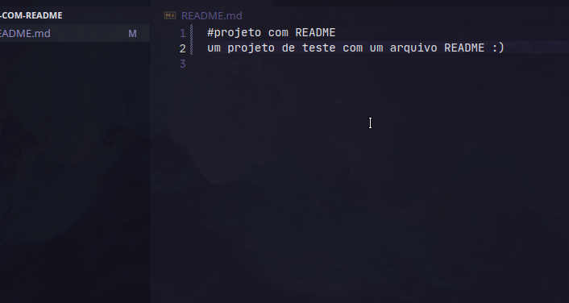

# projeto com README
um projeto de teste com um arquivo README :)

[]

## Tecnologias ultilizadas
- html
- css
- javascript

## como ultilizar

1 clone o projeto
```
git clone <url>
```
2 acesse a pasta do projeto
```
cd projeto
```


